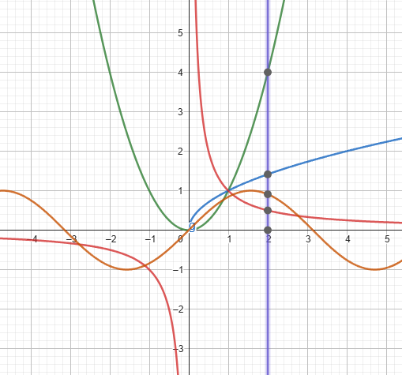

# Derivatives of Functions with Detailed Steps
1. Draw in a single Geogebra notebook the following functions:
      - $f(x) = x^2$
      - $g(x) = \sqrt{x}$
      - $h(x) = \frac{1}{x}$
      - $j(x) = \sin(x)$


      


## 1. \( y(x) = -3x + 3 \)
```math
\begin{aligned}
y(x) &= -3x + 3 \\
y'(x) &= \frac{d}{dx}(-3x) + \frac{d}{dx}(3) \\
y'(x) &= -3 + 0 \\
y'(x) &= -3
\end{aligned}
```

## 2. \( y(x) = \pi x + \sin(1) \)
```math
\begin{aligned}
y(x) &= \pi x + \sin(1) \\
y'(x) &= \frac{d}{dx}(\pi x) + \frac{d}{dx}(\sin(1)) \\
y'(x) &= \pi + 0 \\
y'(x) &= \pi
\end{aligned}
```

## 3. \( y(x) = 4 + \sin(2) \)
```math
\begin{aligned}
y(x) &= 4 + \sin(2) \\
y'(x) &= \frac{d}{dx}(4) + \frac{d}{dx}(\sin(2)) \\
y'(x) &= 0 + 0 \\
y'(x) &= 0
\end{aligned}
```

## 4. \( y(x) = 2x^3 - 3x^2 + 8x - 9 \)
```math
\begin{aligned}
y(x) &= 2x^3 - 3x^2 + 8x - 9 \\
y'(x) &= \frac{d}{dx}(2x^3) - \frac{d}{dx}(3x^2) + \frac{d}{dx}(8x) - \frac{d}{dx}(9) \\
y'(x) &= 6x^2 - 6x + 8 + 0 \\
y'(x) &= 6x^2 - 6x + 8
\end{aligned}
```

## 5. \( y(x) = 6x^{1/3} \)
```math
\begin{aligned}
y(x) &= 6x^{1/3} \\
y'(x) &= 6 \cdot \frac{d}{dx}\left(x^{1/3}\right) \\
y'(x) &= 6 \cdot \frac{1}{3}x^{-2/3} \\
y'(x) &= 2x^{-2/3}
\end{aligned}
```

## 6. \( y(x) = \sqrt{x} \)
```math
\begin{aligned}
y(x) &= x^{1/2} \\
y'(x) &= \frac{d}{dx}(x^{1/2}) \\
y'(x) &= \frac{1}{2}x^{-1/2} \\
y'(x) &= \frac{1}{2\sqrt{x}}
\end{aligned}
```

## 7. \( y(x) = \cos(x) + \sin(x) \)
```math
\begin{aligned}
y(x) &= \cos(x) + \sin(x) \\
y'(x) &= \frac{d}{dx}(\cos(x)) + \frac{d}{dx}(\sin(x)) \\
y'(x) &= -\sin(x) + \cos(x)
\end{aligned}
```

## 8. \( y(x) = 2 \sin(x) \cos(x) \)
```math
\begin{aligned}
y(x) &= 2 \sin(x) \cos(x) \\
y'(x) &= 2 \cdot \left[\frac{d}{dx}(\sin(x)) \cdot \cos(x) + \sin(x) \cdot \frac{d}{dx}(\cos(x))\right] \\
y'(x) &= 2 \cdot \left[\cos(x) \cdot \cos(x) - \sin(x) \cdot \sin(x)\right] \\
y'(x) &= 2 \left[\cos^2(x) - \sin^2(x)\right]
\end{aligned}
```

## 9. \( y(x) = x \sin(x) \)
```math
\begin{aligned}
y(x) &= x \sin(x) \\
y'(x) &= \frac{d}{dx}(x) \cdot \sin(x) + x \cdot \frac{d}{dx}(\sin(x)) \\
y'(x) &= 1 \cdot \sin(x) + x \cdot \cos(x) \\
y'(x) &= \sin(x) + x \cos(x)
\end{aligned}
```

## 10. \( y(x) = (x+1)(x+1) \)
```math
\begin{aligned}
y(x) &= (x+1)^2 \\
y'(x) &= 2(x+1) \cdot \frac{d}{dx}(x+1) \\
y'(x) &= 2(x+1)
\end{aligned}
```

## 11. \( y(x) = \frac{x}{x+1} \)
```math
\begin{aligned}
y(x) &= \frac{x}{x+1} \\
y'(x) &= \frac{(x+1)\frac{d}{dx}(x) - x\frac{d}{dx}(x+1)}{(x+1)^2} \\
y'(x) &= \frac{(x+1)(1) - x(1)}{(x+1)^2} \\
y'(x) &= \frac{x+1 - x}{(x+1)^2} \\
y'(x) &= \frac{1}{(x+1)^2}
\end{aligned}
```

## 12. \( y(x) = (x+1)\exp(x) \)
```math
\begin{aligned}
y(x) &= (x+1)\exp(x) \\
y'(x) &= \frac{d}{dx}(x+1) \cdot \exp(x) + (x+1) \cdot \frac{d}{dx}(\exp(x)) \\
y'(x) &= (1)\exp(x) + (x+1)\exp(x) \\
y'(x) &= \exp(x) + (x+1)\exp(x)
\end{aligned}
```

## 13. \( y(x) = \sin(x^2) \)
```math
\begin{aligned}
y(x) &= \sin(x^2) \\
y'(x) &= \cos(x^2) \cdot \frac{d}{dx}(x^2) \\
y'(x) &= \cos(x^2) \cdot 2x \\
y'(x) &= 2x \cos(x^2)
\end{aligned}
```

## 14. \( y(x) = \exp(-2x) \)
```math
\begin{aligned}
y(x) &= \exp(-2x) \\
y'(x) &= \exp(-2x) \cdot \frac{d}{dx}(-2x) \\
y'(x) &= \exp(-2x) \cdot (-2) \\
y'(x) &= -2\exp(-2x)
\end{aligned}
```

## 15. \( y(x) = \frac{1}{\sin(x+1)} \)
```math
\begin{aligned}
y(x) &= \sin^{-1}(x+1) \\
y'(x) &= -\frac{\cos(x+1)}{\sin^2(x+1)} \cdot \frac{d}{dx}(x+1) \\
y'(x) &= -\frac{\cos(x+1)}{\sin^2(x+1)} \cdot 1 \\
y'(x) &= -\frac{\cos(x+1)}{\sin^2(x+1)}
\end{aligned}
```

## 16. \( y(x) = \sqrt{2x + 1} \)
```math
\begin{aligned}
y(x) &= (2x+1)^{1/2} \\
y'(x) &= \frac{1}{2}(2x+1)^{-1/2} \cdot \frac{d}{dx}(2x+1) \\
y'(x) &= \frac{1}{2}(2x+1)^{-1/2} \cdot 2 \\
y'(x) &= \frac{2}{2\sqrt{2x+1}} \\
y'(x) &= \frac{1}{\sqrt{2x+1}}
\end{aligned}
```

## Problem 2: Prove \( \frac{d}{dx}(\ln(\sin(x))) = \cot(x) \)
```math
\begin{aligned}
\text{Let } y &= \ln(\sin(x)) \\
\frac{d}{dx}(y) &= \frac{d}{dx}(\ln(\sin(x))) \\
\frac{d}{dx}(\ln(\sin(x))) &= \frac{1}{\sin(x)} \cdot \frac{d}{dx}(\sin(x)) \\
\frac{d}{dx}(\ln(\sin(x))) &= \frac{1}{\sin(x)} \cdot \cos(x) \\
\frac{d}{dx}(\ln(\sin(x))) &= \cot(x)
\end{aligned}
```

---

## Problem 3: For \( f(x) = \cos(x) \), verify that \( f''(x) = -f(x) \).
```math
\begin{aligned}
\text{Step 1: Find } f'(x): \\
f(x) &= \cos(x) \\
f'(x) &= \frac{d}{dx}(\cos(x)) = -\sin(x) \\
\\
\text{Step 2: Find } f''(x): \\
f'(x) &= -\sin(x) \\
f''(x) &= \frac{d}{dx}(-\sin(x)) = -\cos(x) \\
\\
\text{Step 3: Verify: } \\
f''(x) &= -\cos(x) = -f(x)
\end{aligned}
```

---

## Problem 4: Using de l'Hospital's Rule, find the improper limits

### (a) \( \lim_{x \to 0} \frac{\sin(x)}{x} \)
```math
\begin{aligned}
\lim_{x \to 0} \frac{\sin(x)}{x} &= \text{Indeterminate form } \frac{0}{0} \\
\text{Differentiate numerator and denominator: } \\
\frac{d}{dx}(\sin(x)) &= \cos(x), \quad \frac{d}{dx}(x) = 1 \\
\lim_{x \to 0} \frac{\sin(x)}{x} &= \lim_{x \to 0} \frac{\cos(x)}{1} \\
\lim_{x \to 0} \frac{\sin(x)}{x} &= \cos(0) = 1
\end{aligned}
```

### (b) \( \lim_{x \to \infty} \frac{\ln(x)}{x} \)
```math
\begin{aligned}
\lim_{x \to \infty} \frac{\ln(x)}{x} &= \text{Indeterminate form } \frac{\infty}{\infty} \\
\text{Differentiate numerator and denominator: } \\
\frac{d}{dx}(\ln(x)) &= \frac{1}{x}, \quad \frac{d}{dx}(x) = 1 \\
\lim_{x \to \infty} \frac{\ln(x)}{x} &= \lim_{x \to \infty} \frac{1/x}{1} \\
\lim_{x \to \infty} \frac{\ln(x)}{x} &= \lim_{x \to \infty} \frac{1}{x} = 0
\end{aligned}
```

### (c) \( \lim_{x \to \infty} \frac{\exp(x)}{x} \)
```math
\begin{aligned}
\lim_{x \to \infty} \frac{\exp(x)}{x} &= \text{Indeterminate form } \frac{\infty}{\infty} \\
\text{Differentiate numerator and denominator: } \\
\frac{d}{dx}(\exp(x)) &= \exp(x), \quad \frac{d}{dx}(x) = 1 \\
\lim_{x \to \infty} \frac{\exp(x)}{x} &= \lim_{x \to \infty} \frac{\exp(x)}{1} \\
\lim_{x \to \infty} \frac{\exp(x)}{x} &= \infty
\end{aligned}
```

---

## Problem 5: Physics Problem

### Given: \( x(t) = 3t^2 - 6t + 1 \)

#### (a) Find velocity \( V(t) = x'(t) \):
```math
\begin{aligned}
x(t) &= 3t^2 - 6t + 1 \\
V(t) &= \frac{d}{dt}(3t^2 - 6t + 1) \\
V(t) &= 6t - 6
\end{aligned}
```

#### (b) Find acceleration \( a(t) = V'(t) = x''(t) \):
```math
\begin{aligned}
V(t) &= 6t - 6 \\
a(t) &= \frac{d}{dt}(6t - 6) \\
a(t) &= 6
\end{aligned}
```

#### (c) Find \( V(2) \) and \( a(2) \):
```math
\begin{aligned}
V(2) &= 6(2) - 6 = 12 - 6 = 6 \\
a(2) &= 6 \quad \text{(constant acceleration)}
\end{aligned}

